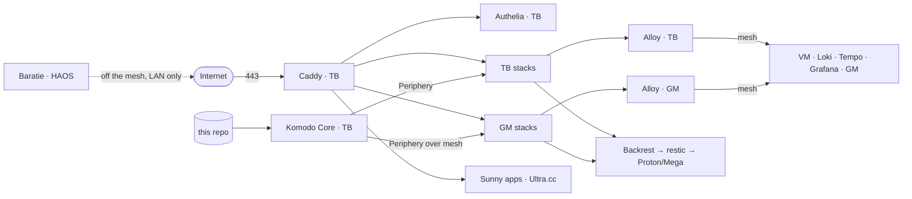

# Architecture

Four ships, one repo. Komodo pulls this repo onto each node and runs the compose stacks;
Caddy on Thriller Bark is the only public door.

Sunny and Baratie run no Docker and no collector; they are reached over their own public
HTTPS/SSH and are outside the mesh.

| Layer | Doc | What it owns |
|---|---|---|
| Nodes | [nodes](domains/nodes.md) | The four machines, benchmarks, placement rule |
| Networking | [networking](domains/networking.md) | Headscale mesh, binds, firewall, DNS |
| Ingress | [ingress](domains/ingress.md) | Caddy edge, TLS, the three auth outcomes |
| Secrets | [secrets](domains/secrets.md) | SOPS + age, file modes, blast radius |
| Deploy | [deploy](domains/deploy.md) | Komodo sync, Periphery, control-plane updates |
| Backups | [backups](domains/backups.md) | Plan assignments, restic, disaster recovery |
| Observability | [observability](domains/observability.md) | Metrics, logs, dashboards, alerting |

Constants live in [REFERENCE.md](REFERENCE.md), decisions in [ADR/](ADR/), procedures in
[runbooks/](runbooks/).

## Rules that cross every layer

- Services bind `127.0.0.1` on TB and `100.64.0.1` on GM, never `0.0.0.0`
  ([why](ADR/2026-07-19-services-bind-private-addresses.md)).
- Cross-node service calls go through the public edge, not the mesh
  ([why](ADR/2026-07-27-cross-node-calls-use-the-public-edge.md)).
- The mesh carries Komodo Periphery and observability only; Sunny is not on it
  ([why](ADR/2026-07-25-sunny-stays-off-the-mesh.md)).
- Placement follows the benchmarks: TB is the workhorse, GM is light and legacy
  ([why](ADR/2026-07-22-placement-follows-benchmarks.md)).
