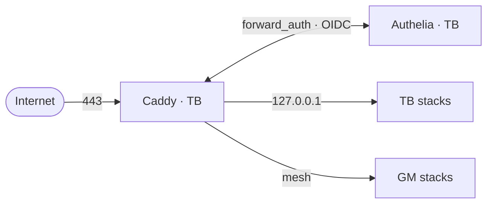
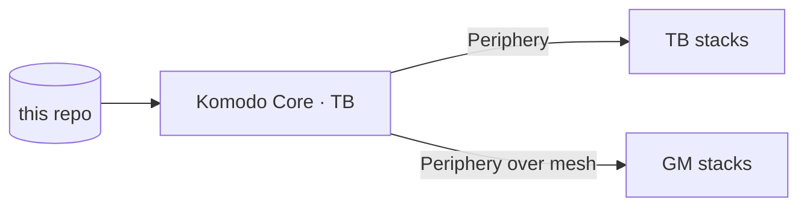
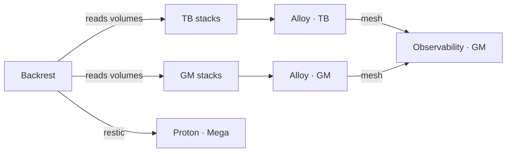

# Architecture

Four ships, one repo. Komodo pulls this repo onto each node and runs the compose stacks;
Caddy on Thriller Bark is the only public door.

**Request path** — one door, two backends. TB is loopback, GM is over the mesh.

**Deploy path** — the repo is the source, Komodo Core the only thing that acts on it.

**Telemetry and backups** — apps are passive in both, they are read and scraped.

Sunny and Baratie appear in none of the three. They run no Docker and no collector and are
outside the mesh; Sunny's apps serve on their own Ultra.cc hostnames, and the edge holds
one 302 redirect to them. Sunny joins the diagrams when it joins the infra.

| Layer | Doc | What it owns |
|---|---|---|
| Nodes | [nodes](domains/nodes.md) | The four machines, benchmarks, placement rule |
| Networking | [networking](domains/networking.md) | Headscale mesh, binds, firewall, DNS |
| Ingress | [ingress](domains/ingress.md) | Caddy edge, TLS, the three auth outcomes |
| Secrets | [secrets](domains/secrets.md) | SOPS + age, file modes, blast radius |
| Deploy | [deploy](domains/deploy.md) | Komodo sync, Periphery, control-plane updates |
| Backups | [backups](domains/backups.md) | Plan assignments, restic, disaster recovery |
| Observability | [observability](domains/observability.md) | Metrics, logs, dashboards, alerting |

Constants live in [REFERENCE.md](REFERENCE.md), decisions in [ADR/](ADR/), procedures in
[runbooks/](runbooks/).

## Rules that cross every layer

- Services bind `127.0.0.1` on TB and `100.64.0.1` on GM, never `0.0.0.0`
  ([why](ADR/2026-07-19-services-bind-private-addresses.md)).
- Cross-node calls **between apps** go through the public edge, not the mesh
  ([why](ADR/2026-07-27-cross-node-calls-use-the-public-edge.md)). Infrastructure is the
  exception and uses the mesh directly: Caddy reverse-proxying GM, Komodo Periphery, Alloy.
- The mesh carries that infrastructure only, never app traffic; Sunny is not on it at all
  ([why](ADR/2026-07-25-sunny-stays-off-the-mesh.md)).
- Placement follows the benchmarks: TB is the workhorse, GM is light and legacy
  ([why](ADR/2026-07-22-placement-follows-benchmarks.md)).
